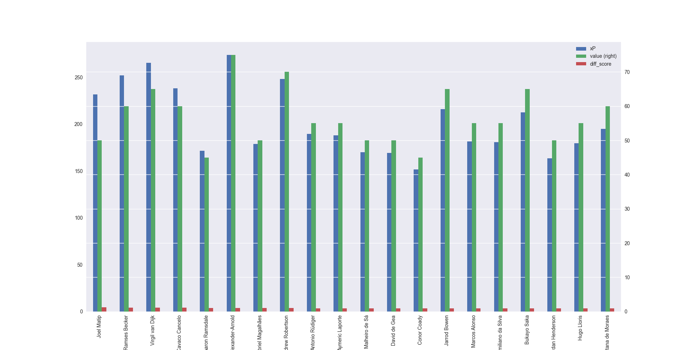

# Fantasy Premier League

## What is it?

[Fantasy Premier League](https://fantasy.premierleague.com/) is simply where you choose players within a budget that
you think will perform well. They receive points based on how well they perform. It is extremely popular with over 8
million teams created for the current season which began just last week.

Here is an example of your team, and the cost associated:

## Key Questions:

> Here, I have tried to put together the questions necessary for picking a good team and tried to demonstrate the
> asnwer with graphics. This is an ongoing attempt - see [Future Questions](#future-questions)

> NB:
> - 'xP' stands for expected points and is created using expected goals, assists, etc. It very accurately predicts 
    > real points but with far less variance/noise.
> - Value is the player's original value when they played their first game.
### 1) Which teams overperformed most relative to their cost last season?

#### a) All players:

#### b) Only Frequent (played > 900 mins last season) players:

&nbsp;&nbsp;&nbsp;

### 2) Which team plays the same players most often?

&nbsp;&nbsp;&nbsp;

### 3) Which players overperformed relative to their price the most?

#### a) Scatter All players (frequent):

#### b) All players:

#### c) Attack:

#### d) Midfield:

#### e) Defence:

#### f) Goalkeeper:

&nbsp;&nbsp;&nbsp;

### 4) Which positions earn the most points?

#### 1) All players:

#### 2) Frequent players:

#### 3) Mainstays:

## Limitations

* This data is from the previous season and the value relates to the beginning of that season. The costs have
  changed significantly for some players this season and move them from good value to questionable. However, it
  still remains a good guide.
* The rotation number is off for some clubs, and should be taken with a pinch of salt - most notably Newcastle who 
  introduced a lot of new signings (with a new manager) in the January transfer window. 
* Obviously new signings from other leagues are not included here. There are a few great options (e.g. Haaland)
  which are not listed here.
* One season is possibly not the best sample size - it would be interesting to compare these graphs over a number of
  seasons.

## Key takeaways 🍕 🍔 🍟

1) Given you get double points for a captain each week, you should always have Mo Salah and always pick him as
   captain unless you have **very** good reason to do otherwise.
2) **Do not** be cheap with your goalkeeper and defenders. They may not get you the most points but they offer the
   best return on investment - going for the most expensive options is rarely a bad idea.
3) Big clubs offer the best buys. It's boring but the best value for money lies in the best teams, particularly for
   defenders and goalkeepers. Aside from a tiny number of exceptional talents (James Ward-Prowse, Jarrod Bowen, 
   Bukayo Saka) no players outside the top 3-4 teams tend to be good buys.
4) Liverpool > City in terms of value. Liverpool has far less rotation than City and tend to be better value
   for money overall. You're probably making a mistake not maxing out Liverpool picks. 

## Future Questions

* How (much) does the strength of the opposition team affect players' scoring?
* How many points do you lose/gain by being home or away?
* Which teams perform best home/away?
* How well can you predict future performance based on say 5, 10, 20 games?