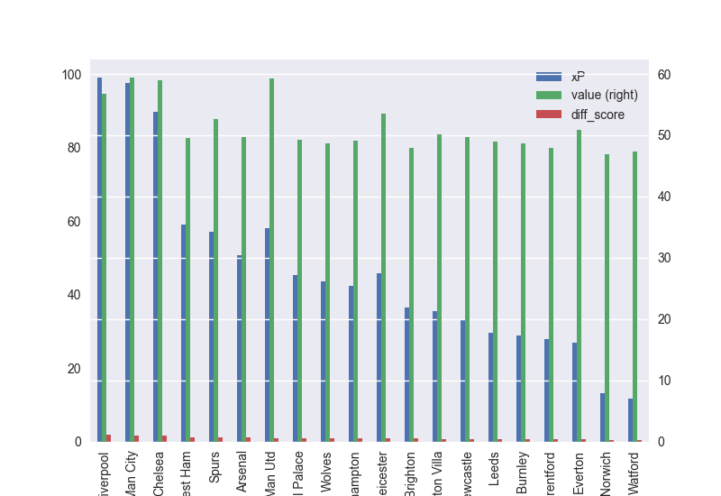
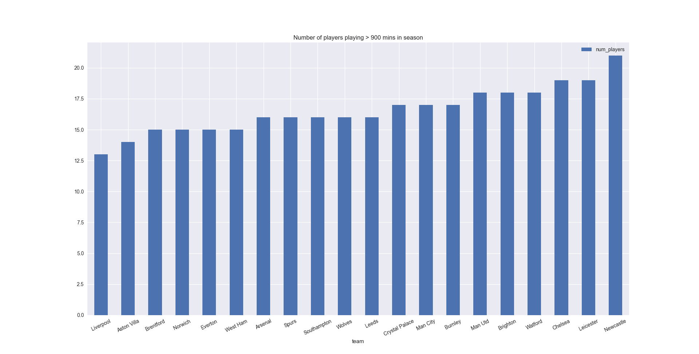
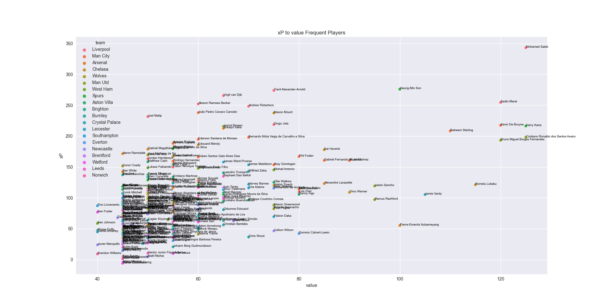
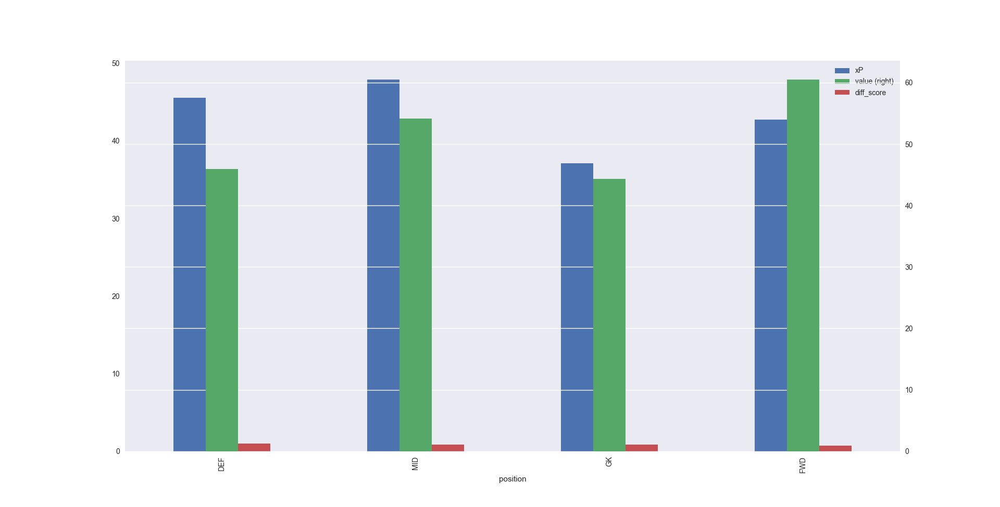

Plan:

Key Questions:
1) Which players are the best value given last season form? Half season?
   1) 
2) Which teams overperformed most relative to their last season?
   1) All players:
   
   2) Frequent players:
   

&nbsp;&nbsp;&nbsp;
2) Which team plays the same players most often? Coaches?
   

&nbsp;&nbsp;&nbsp;
3) Which players overperformed relative to their price the most?
   1) Scatter All players (frequent):
   
   2) All players:
   
   3) Attack: 
   
   4) Midfield (Mo Salah is 11th): 
   
   5) Defence: 
   
   6) Goalkeeper: 
   

&nbsp;&nbsp;&nbsp;
4) How much does the opponent matter for expected points?

&nbsp;&nbsp;&nbsp;
5) Which positions earn the most points?
   1) All players:
      
   2) Frequent players:
      
   3) Mainstays:
      